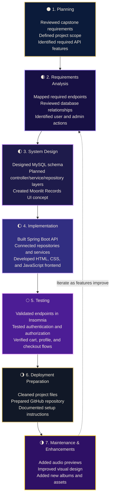

<div align="center">

# 🌙✨ Moonlit Records Application ✨🌙

### A full-stack e-commerce record store with a celestial listening experience


<br>

🌌 **Moonlit Records** is a modern record shop E-Commerce API project.  
Users can browse albums, search by genre, preview audio, add records to a cart, manage a profile, and complete checkout through a Spring Boot API.

</div>

---

## 🔮 Project Vision

Moonlit Records was designed to feel like a late-night record shop under the stars navy blue skies, purple cosmic energy, glowing gold accents, and a listening-station experience.

The goal was to build more than a basic store. I wanted the site to feel interactive and memorable while still meeting the full backend requirements for an e-commerce API.

---

## 🎯 Project Purpose

The purpose of Moonlit Records is to demonstrate a full-stack e-commerce application using a Java Spring Boot API, MySQL database, and a custom HTML/CSS/JavaScript frontend. The application allows users to browse products, manage a shopping cart, update a profile, and complete checkout through secure API endpoints.

## 👩‍💻 My Role

For this project, I worked as the full-stack developer. I implemented backend API functionality, connected the application to MySQL, tested endpoints in Insomnia, and customized the frontend into a modern Moonlit Records shopping experience.


### 🌙 Customer Features

- Browse all products
- Filter albums by category and genre
- Search albums and artists
- View album covers
- Preview audio clips for albums
- Add products to shopping cart
- View cart total
- Clear shopping cart
- Checkout and create an order
- Login and authenticated cart access
- View and update user profile

### 🛡️ Admin/API Features

- Create categories
- Update categories
- Delete categories
- Create products
- Update products
- Delete products
- Protected routes using Spring Security and JWT
- Role-based authorization for admin actions

---

## 🪐 Tech Stack

| Layer | Technology |
|---|---|
| Backend | Java, Spring Boot |
| Security | Spring Security, JWT |
| Database | MySQL |
| Frontend | HTML, CSS, JavaScript |
| API Testing | Insomnia |
| Version Control | Git + GitHub |
| Design Theme | Stars-inspired navy, purple, gold, and stars |

---

## 🌌 Website Theme

The frontend was customized with a modern stars-inspired record store design:

- Navy blue background
- Purple cosmic accents
- Gold buttons and highlights
- Starry visual style
- Album-card grid
- Interactive listening station
- Shopping cart and checkout flow

---
## 🧭 Software Development Life Cycle

This project followed an iterative SDLC process. Each phase helped guide the backend API, database design, frontend experience, and final testing.




## 🛠️ Challenges and Solutions

| Challenge | Solution |
|---|---|
| Understanding Spring Security roles | Tested routes in Insomnia and updated authorization rules |
| Connecting frontend cart actions to authenticated API routes | Used JWT login flow and protected cart endpoints |
| Making album images and audio previews load correctly | Matched product image names with local asset filenames |
| Debugging 401, 403, and 404 responses | Compared expected API behavior with endpoint security rules |
| Styling the frontend beyond the starter design | Created a custom navy, purple, and gold Moonlit Records theme |

## 🧪 Testing Summary

Testing was completed using Insomnia. I verified successful responses and expected error responses for protected routes.

| Phase | Tested Feature | Result |
|---|---|---|
| Phase 1 | Categories | Passed |
| Phase 2 | Products | Passed |
| Phase 3 | Shopping Cart | Passed |
| Phase 4 | Profile | Passed |
| Phase 5 | Checkout | Passed |

## 🌙 Reflection

This project helped me better understand how the frontend, backend, database, and security layers work together in a full-stack application. One of the biggest lessons I learned was how important it is to test each endpoint carefully and understand whether an error is caused by code, authentication, authorization, or missing data.
```
